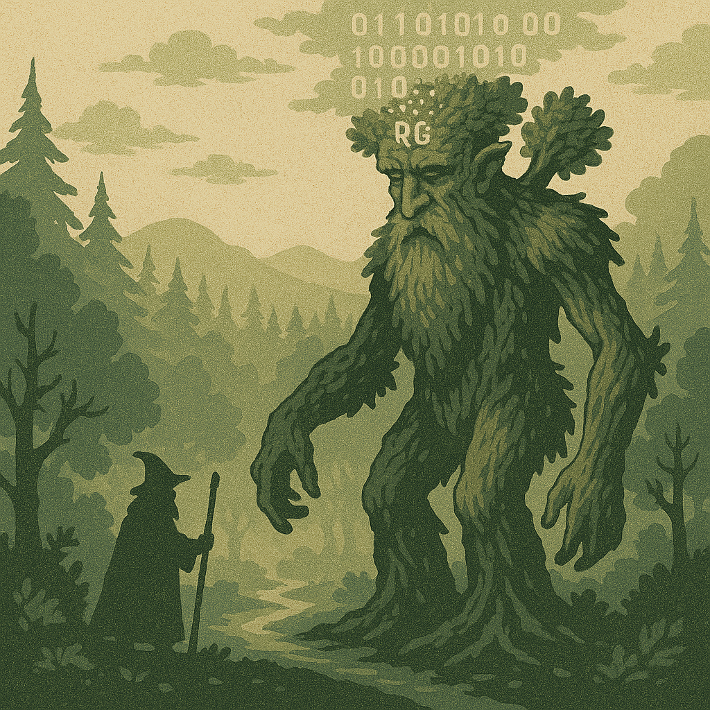

# RAGent: Your Personal & Customer Knowledge Brain

<p align="center">
  
</p>

<p align="center"><i>RAGent: A wise helper for your knowledge forests.</i></p>

**RAGent lets you store your own (or your customers') documents and use them as a smart helper for complex, context-specific questions.**

> Never struggle to remember all the details again—just upload your content, select the context, and ask! RAGent will answer strictly from your chosen documents, acting as an external brain for your projects, clients, or personal knowledge.

> **Privacy:** You can use commercial (OpenAI) or local (Ollama) language models. For sensitive or private data, use a local model so nothing is ever sent to the cloud.

## Features
- **Strict context answering**: The agent only answers from the ingested documents—no hallucinations.
- **Multi-client support**: Choose a context folder at startup for per-client/document QA.
- **Local & remote LLMs**: Use OpenAI (gpt-4o, gpt-4, etc.) or Ollama (local models).
- **Local embeddings**: Uses HuggingFace sentence-transformers or Ollama for embeddings; avoids OpenAI quota issues.
- Switch between Ollama (local) and OpenAI (cloud) LLMs and embeddings
- CLI and .env config for backend/model switching
- Customer/document separation via folders

## Architecture


*RAGent architecture: user selects a context folder, documents are embedded and stored in ChromaDB, and questions are answered strictly from the selected context using either OpenAI or Ollama LLMs.*

---

## Quick Start

### Ollama (Local LLM) Setup
To use local models, you need [Ollama](https://ollama.com/) installed and running:
1. **Install Ollama:** See [Ollama downloads](https://ollama.com/download) for your OS.
2. **Start Ollama:** Run `ollama serve` or start the Ollama app.
3. **Pull a model:** For example: `ollama pull llama2` or your chosen model (e.g. `deepseek-r1:8b`).
4. **Configure `.env`:** Set `LLM_BACKEND=ollama` and `OLLAMA_MODEL=llama2` (or your chosen model).

**If you do not want to use Ollama:**
- Set `LLM_BACKEND=openai` and provide your OpenAI API key and model in `.env`.

**Troubleshooting:**
- If you see errors like "Could not connect to Ollama" or "model not found," make sure Ollama is running and the model is pulled.

1. **Install dependencies**
   ```sh
   pip install -r requirements.txt
   ```
2. **Configure environment**
   - Copy `.env.example` to `.env` and set your API keys and model names.
   - Example:
     ```
     OPENAI_API_KEY=sk-...
     LLM_BACKEND=openai   # or ollama
     OPENAI_MODEL=gpt-4o  # or gpt-4, etc.
     EMBEDDING_BACKEND=hf # or ollama/openai
     ```
3. **Add your customer or project content**
   - Place `.txt` files inside folders under `data/` (e.g., `data/clientA/`, `data/clientB/`, `data/facts/`).
   - Each folder is a separate knowledge base (brain) for a client, project, or topic.
   - Example folder structure:
     ```
     data/
       clientA/
         onboarding.txt
         api_endpoints.txt
       clientB/
         requirements.txt
         meeting_notes.txt
       facts/
         team.txt
         mission.txt
     ```
4. **Run the agent**
   ```sh
   python -m src.main
   ```
   - Select the context folder (e.g., `clientA`) at the prompt.
   - Ask your question. RAGent will answer using only the selected folder’s content.

## Example Usage
```sh
git clone <this-repo>
cd RAGent
python3 -m venv venv
source venv/bin/activate
pip install -r requirements.txt
```

### 2. Add Knowledge Base
Put your `.txt` files in a folder, e.g.:
```
data/clientA/clientA.txt
```
Example content:
```
The clientA project involves creating a new API endpoint.
```

### 3. Configure `.env`
Create a `.env` in the project root. Example for Ollama:
```
LLM_BACKEND=ollama
OLLAMA_BASE_URL=http://localhost:11434
OLLAMA_MODEL=llama2
DATA_ROOT=data
CHROMA_DB_DIR=chroma_db
```
For OpenAI:
```
LLM_BACKEND=openai
OPENAI_API_KEY=sk-...
OPENAI_MODEL=gpt-4o
DATA_ROOT=data
CHROMA_DB_DIR=chroma_db
```

### 4. Run the Agent

#### Default (uses `.env`):
```sh
python -m src.main
```

#### Override backend/model via CLI:
```sh
python -m src.main --backend ollama --model llama2
python -m src.main --backend openai --model gpt-4
```

---

## Advanced RAG Pipeline (Future Directions)

RAGent is designed for reliability and simplicity, but can be extended with advanced techniques from the latest RAG research, such as:

- **Multi-hop Reasoning / Chain-of-Thought**: Answer complex questions that require combining information from multiple documents or steps.
- **Query Rewriting / Self-Refinement**: Automatically rephrase or expand your question to improve retrieval.
- **Retrieval Fusion / Re-ranking**: Combine results from multiple retrieval methods (keyword, vector, etc.) and re-rank them for relevance.
- **Tool-Augmented or Agentic RAG**: Let the agent use plugins, calculators, or external APIs as part of its answer process.
- **Answer Verification / Self-Consistency**: Double-check answers or generate multiple candidates to select the most reliable response.
- **Long-Context Handling / Summarization**: Summarize or synthesize information across many documents for concise overviews.

For a comprehensive list of state-of-the-art RAG methods and resources, see:

[Awesome-RAG-Reasoning](https://github.com/DavidZWZ/Awesome-RAG-Reasoning)

## Usage
- Ask questions about your documents interactively.
- The agent retrieves relevant context and answers, grounded ONLY in your knowledge base.
- Example (project-specific context):
  ```
  You: What is the onboarding code for clientA?
  [Retrieved context]:
    [1] The onboarding code for clientA is XJ-42B.
  Agent: The onboarding code for clientA is XJ-42B.
  ```

## Switching LLMs
- Change `LLM_BACKEND`/`MODEL` in `.env` or use CLI flags (`--backend`, `--model`).
- Ollama must be running and the model pulled (e.g. `ollama pull llama2`).

## Adding More Data
- Add more `.txt` files to your data folder and rerun the agent.

## Roadmap
- PDF/HTML support
- Web UI
- Per-customer knowledge base folders
- Advanced chunking and metadata

---

## Security
- `.env`, `data/`, and `chroma_db/` are gitignored by default.

---

## License
MIT